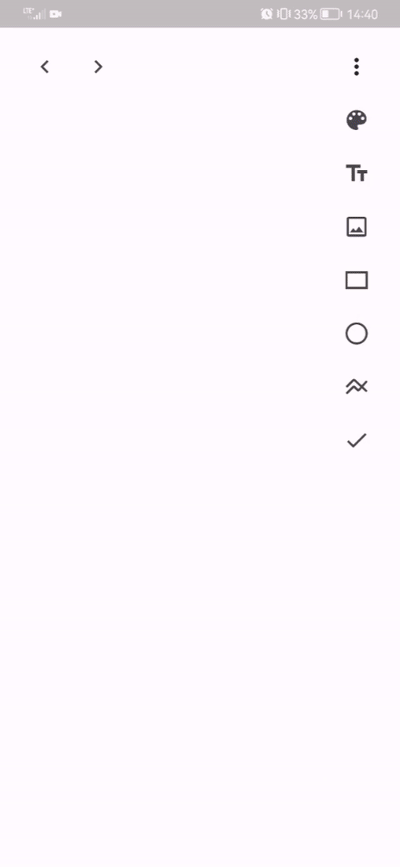

# Paint v2

**Paint v2** is an intuitive photo editing application that allows users to create and modify images using a variety of tools. The application offers the following features:
-   **Brush Drawing**: Freehand drawing on images with customizable brush color and thickness.
   
-   **Shape Drawing**: Adding geometric shapes such as circles, squares, and more to your photos.
   
-   **Image Insertion**: Ability to insert additional images into the project.
   
-   **Text Addition**: Adding and editing text on photos with options to customize font, color, and size.
   
-   **Element Removal**: Easy removal of added elements.
   
-   **Moving and Scaling**: Dragging and resizing added elements for precise adjustments.
   
-   **RGB Color Picker**: Choose any color from the RGB palette for drawing, shapes, text, and other elements.

